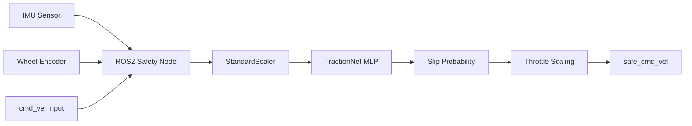
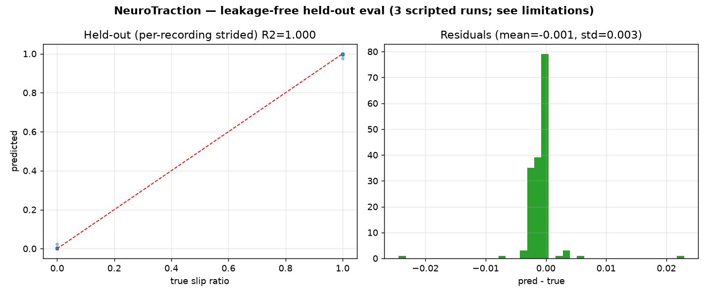

# 🧠 NeuroTraction — Real-Time ML Traction Control for Ground Robots (ROS2)

<div align="center">

[](https://www.python.org/downloads/)
[](https://docs.ros.org/en/humble/)
[](https://pytorch.org/)
[-yellow.svg)](#-benchmark--model-performance)
[](https://opensource.org/licenses/MIT)

**NeuroTraction** is a real-time AI-powered traction safety system for ground robots. It uses a lightweight neural network to estimate a wheel **slip ratio** from live IMU and odometry data, dynamically throttling motor commands to prevent loss of traction before it occurs.

</div>

---

1. 📖 Overview
---

Ground robots operating on uneven, wet, or loose terrain are highly susceptible to **wheel slip**, which causes trajectory deviation, mission failure, and potential hardware damage. NeuroTraction solves this by embedding a **TractionNet** neural network inside a **ROS2 safety node** that estimates a **slip ratio (0–1)** and scales velocity commands. Inference is gated by a **50 ms rate limiter** (≤20 Hz) inside the command callback.

2. 🔧 What I Built
---

Solo project spanning the ML model, ROS2 integration, simulation data, and CI.

| # | Domain | Details | Specifications |
|---|---|---|---|
| 1 | **TractionNet MLP** | Lightweight Sequential MLP for low-latency slip prediction | 7-feature input, R²≈1.0 on a tiny 3-run set (see caveat) |
| 2 | **Feature Engineering & Scaling** | `StandardScaler` normalization for 6-axis IMU + encoder velocity (fit on train only) | Leakage-free feature fusion |
| 3 | **Data Augmentation** | Synthetic terrain augmentation for generalization across ground types | Noise injection & signal shifting |
| 4 | **Model Optimization** | Hyperparameter tuning + regularization for high-precision slip prediction | small MLP, sub-ms inference expected (not yet benchmarked) |
| 5 | **ROS2 Safety Node** | Real-time node subscribing to IMU + odom | ROS2 Humble, ≤20Hz (rate-limited) |
| 6 | **Command Interceptor** | Modular scaling layer (publishes a throttled `cmd_vel`) for any navigation stack | Linear command interpolation |
| 7 | **Isaac Sim Simulation** | Synthetic data-collection environment for training data | Realistic terrain physics |
| 8 | **Validation Suite & CI** | `pytest` leakage guard (scaler-fit-before-split, hardcoded paths, methodology) | CI-enforced, no failure masking |

3. ✨ Key Capabilities
---

| # | Capability | Description | Technical Implementation |
|---|---|---|---|
| 1 | **20 Hz Inference** | Slip estimate gated by a 50ms rate limiter (≤20Hz) | PyTorch eager `forward()` on a small MLP |
| 2 | **Dynamic Throttling** | Auto-scaling of velocity based on slip ratio estimate | Linear & Sigmoid scaling modes |
| 3 | **Modular Integration** | Plugs into standard ROS2 navigation stacks | Subscribes to `/cmd_vel_raw`, publishes namespaced `cmd_vel` |
| 4 | **Safety Floor** | Guarantees a minimum 10% throttle floor to avoid full stops | Hardcoded safety threshold |

4. 🏗️ Architecture
---

### 4.1 Pipeline Flow



5. 🚀 Quick Start
---

### 5.1 Prerequisites
- Python 3.8+
- ROS2 Humble (or compatible)
- PyTorch

### 5.2 Installation
```bash
git clone https://github.com/Rhutvik-pachghare1999/neurotraction-ros2-slip-control.git
cd neurotraction-ros2-slip-control
pip install -r requirements.txt
```

6. 💻 CLI Reference
---

| # | Command | Description |
|---|---|---|
| 1 | `python scripts/traction_inference.py` | Launch the real-time ROS2 safety node (`neural_traction_control`) |
| 2 | `python learning/train_traction_ai_v2.py` | Train TractionNet + print held-out R² |
| 3 | `python learning/evaluate_traction_ai.py` | Evaluate a saved model on the dataset |
| 4 | `pytest tests/ -v` | Run the leakage-guard validation suite |

> The node loads the latest trained model/scaler from `learning/models` and
> `learning/scalers` (override with `NEUROTRACTION_MODEL` / `NEUROTRACTION_SCALER`).
> Train once before running the node.

7. 🔧 ROS2 Integration
---

| ROS2 Topic | Message Type | Description |
|---|---|---|
| `/a200_0000/sensors/imu_0/data` | `sensor_msgs/Imu` | 6-axis IMU (acc + gyro) |
| `/a200_0000/platform/odom` | `nav_msgs/Odometry` | Wheel/encoder velocity |
| `/cmd_vel_raw` | `geometry_msgs/Twist` | Raw input velocity command |
| `/a200_0000/cmd_vel` | `geometry_msgs/TwistStamped` | Safe throttle-scaled output |

> Topic names above match the current node (`scripts/traction_inference.py`),
> configured for a Clearpath Husky A200 (`a200_0000` namespace). Rename the
> subscriptions/publisher for a different platform.

8. 📊 Benchmark & Model Performance
---



| Metric | Result | Status |
|---|---|---|
| **R² Score (held-out, seed 42)** | 0.9999 | ⚠️ see caveat |
| **Inference Rate** | ≤20 Hz (50ms rate limiter) | ✅ by design |
| **Inference Latency** | sub-ms expected (5-layer MLP) | ⚠️ not yet benchmarked |
| **Binary Grip/Slip Accuracy (held-out)** | ~99.4% | ✅ measured |

> **Evaluation methodology — read this before trusting the number.** Metrics
> come from a **per-recording strided hold-out** (within each of the 3 recordings,
> every 5th sample by time order is held out; `StandardScaler` fit on train rows
> only; seeds fixed for reproducibility). Reproduce:
> `python learning/train_traction_ai_v2.py`.
>
> **What the R² does and does not mean:**
> - Earlier versions reported **0.9912 R² / 100%** from a scaler fit on the full
>   dataset and evaluation over training data — that was **leakage**, now removed.
> - The current **0.9999** is leakage-free (no scaler leak, train/test rows are
>   distinct) but it is **not evidence of generalization**. The dataset is only
>   **3 short scripted fixed-velocity runs**; held-out samples sit ~0.05 s from a
>   training neighbor, so the model is essentially *interpolating* between nearby
>   points. A near-perfect R² here mostly says "the split is easy," not "the model
>   generalizes."
> - A pure temporal tail split is degenerate (each run ends in a constant
>   fully-slipping tail → R² undefined), and a random row split leaks. There is no
>   clean episode-level split possible with only 3 runs.
> - **Honest bottom line:** this is a working, leakage-free *prototype* on limited
>   data. The credible next step is collecting diverse multi-run/multi-terrain
>   data and doing a true leave-one-recording-out evaluation before claiming a
>   generalization number.

9. 🧹 Testing
---

### 9.1 CI/CD Workflow
GitHub Actions runs on every push/PR (`.github/workflows/ci.yml`), no failure masking:
- **Leakage guard**: fails if a scaler is ever fit on the full dataset before the train/test split
- **Path guard**: fails on hardcoded absolute paths in the training scripts
- **Methodology check**: verifies split-before-scale is preserved

```bash
pytest tests/ -v
```

10. 📐 Design Decisions
---

| # | Decision | Rationale | Benefit |
|---|---|---|---|
| 1 | **MLP over RNN** | IMU noise is high, snapshot is sufficient | Lower latency than sequential models |
| 2 | **Command Interceptor** | Modular safety layer | Works with any navigation stack |
| 3 | **10% Min Throttle** | Prevent total mission stall | Smooth operation on transition zones |

11. 🤝 Contributing
---

Contributions are welcome! Please follow these steps:
1. Fork the repo.
2. Create a feature branch.
3. Submit a Pull Request.

12. 📜 License
---

Distributed under the **MIT License**. See `LICENSE` for details.

13. 📧 Contact & Support
---

**Rhutvik Pachghare** | Master's in Robotics & Automation | Arizona State University
- [GitHub](https://github.com/Rhutvik-pachghare1999)
- [LinkedIn](https://www.linkedin.com/in/rhutvik-pachghare/)
