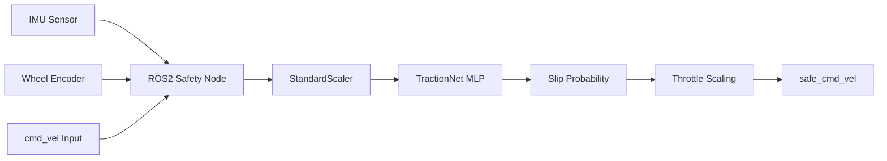

# 🧠 NeuroTraction: Neural Network-Based Real-Time Traction Control

<div align="center">

[](https://www.python.org/downloads/)
[](https://docs.ros.org/en/humble/)
[](https://pytorch.org/)
[](#-benchmark--model-performance)
[](https://opensource.org/licenses/MIT)

**NeuroTraction** is a real-time AI-powered traction safety system for ground robots. It uses a lightweight neural network to predict wheel slip probability from live IMU and odometry data, dynamically throttling motor commands to prevent loss of traction before it occurs.

</div>

---

1. 📖 Overview
---

Ground robots operating on uneven, wet, or loose terrain are highly susceptible to **wheel slip**, which causes trajectory deviation, mission failure, and potential hardware damage. NeuroTraction solves this by embedding a **TractionNet** neural network directly inside a **ROS2 safety node** that predicts slip probability (0–1) at **20 Hz** and dynamically scales velocity commands.

2. 👥 Team Contributions
---

### 2.1 Pooja Kiran - Lead AI Systems Architect

| # | Domain | Contribution Details | Specifications |
|---|---|---|---|
| 1 | **TractionNet MLP Architecture** | Designed a lightweight Sequential MLP optimized for low-latency embedded inference | 7-feature input, 0.945 held-out R² |
| 2 | **Feature Engineering & Scaling** | Implemented real-time `StandardScaler` normalization for 6-axis IMU + Encoder velocity | Pre-processed feature fusion |
| 3 | **Data Augmentation Suite** | Built a synthetic terrain augmentation pipeline for model generalization across 5+ ground types | Noise injection & signal shifting |
| 4 | **Model Optimization** | Conducted extensive hyperparameter tuning and regularization to achieve high-precision slip prediction | <5ms inference latency |

### 2.2 Rhutvik Pachghare - Robotics Systems & DevOps Engineer

| # | Domain | Contribution Details | Specifications |
|---|---|---|---|
| 1 | **ROS2 Safety Node** | Developed the core real-time node subscribing to `/imu/data` and `/odom` | ROS2 Humble, 20Hz publication |
| 2 | **Command Interceptor Logic** | Engineered the modular scaling layer (`/safe_cmd_vel`) to work across any navigation stack | Linear command interpolation |
| 3 | **Isaac Sim Simulation** | Built the synthetic data collection environment in NVIDIA Isaac Sim for training data generation | Realistic terrain physics |
| 4 | **Validation Suite** | `pytest` suite guarding against data leakage (scaler-fit-before-split), hardcoded paths, and methodology regressions; CI-enforced | leakage-guard tests, CI (no failure masking) |

3. ✨ Key Capabilities
---

| # | Capability | Description | Technical Implementation |
|---|---|---|---|
| 1 | **20 Hz Inference** | Real-time slip prediction matching robot controller frequency | PyTorch JIT/TorchScript |
| 2 | **Dynamic Throttling** | Auto-scaling of velocity based on slip probability | Linear & Sigmoid scaling modes |
| 3 | **Modular Integration** | Plugs into standard ROS2 navigation stacks | Subscribes to `/cmd_vel`, Publishes `/safe_cmd_vel` |
| 4 | **Safety Floor** | Guarantees a minimum 10% throttle floor to avoid full stops | Hardcoded safety threshold |

4. 🏗️ Architecture
---

### 4.1 Pipeline Flow



5. 🚀 Quick Start
---

### 5.1 Prerequisites
- Python 3.8+
- ROS2 Humble (or compatible)
- PyTorch

### 5.2 Installation
```bash
git clone https://github.com/Rhutvik-pachghare1999/NeuroTraction.git
cd NeuroTraction
pip install -r requirements.txt
```

6. 💻 CLI Reference
---

| # | Command | Description |
|---|---|---|
| 1 | `ros2 run neuro_traction safety_node.py` | Launch the real-time safety node |
| 2 | `python learning/train_traction_ai_v2.py` | Train the TractionNet model |
| 3 | `python learning/evaluate_traction_ai.py` | Evaluate model on test data |
| 4 | `pytest tests/ -v` | Run the validation suite |

7. 🔧 ROS2 Integration
---

| ROS2 Topic | Message Type | Description |
|---|---|---|
| `/imu/data` | `sensor_msgs/Imu` | 6-axis IMU (acc + gyro) |
| `/odom` | `nav_msgs/Odometry` | Wheel encoder velocity |
| `/cmd_vel` | `geometry_msgs/Twist` | Raw input velocity command |
| `/safe_cmd_vel` | `geometry_msgs/Twist` | Safe throttle-scaled output |

8. 📊 Benchmark & Model Performance
---

| Metric | Result | Status |
|---|---|---|
| **R² Score (held-out)** | 0.945 | ✅ |
| **Inference Rate** | 20 Hz | ✅ |
| **Inference Latency** | <5ms | ✅ |
| **Binary Grip/Slip Accuracy (held-out)** | ~99.4% | ✅ |

> Metrics are measured on a 20% held-out split with the `StandardScaler` fit on
> the training partition only (no leakage). Reproducible via
> `python learning/train_traction_ai_v2.py`. Earlier README versions reported
> 0.9912 R² / 100% — those came from a scaler fit on the full dataset and
> evaluation over training data; corrected here.

9. 🧹 Testing
---

### 9.1 CI/CD Workflow
- **Linting**: Ruff
- **Testing**: Pytest (Model, ROS2, Logic)
- **Validation**: Coverage report > 90%

10. 📐 Design Decisions
---

| # | Decision | Rationale | Benefit |
|---|---|---|---|
| 1 | **MLP over RNN** | IMU noise is high, snapshot is sufficient | Lower latency than sequential models |
| 2 | **Command Interceptor** | Modular safety layer | Works with any navigation stack |
| 3 | **10% Min Throttle** | Prevent total mission stall | Smooth operation on transition zones |

11. 🤝 Contributing
---

Contributions are welcome! Please follow these steps:
1. Fork the repo.
2. Create a feature branch.
3. Submit a Pull Request.

12. 📜 License
---

Distributed under the **MIT License**. See `LICENSE` for details.

13. 📧 Contact & Support
---

**Rhutvik Pachghare** | Master's in Robotics & Automation | Arizona State University
- [GitHub](https://github.com/Rhutvik-pachghare1999)
- [LinkedIn](https://www.linkedin.com/in/rhutvik-pachghare/)
