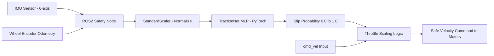

# 🧠 NeuroTraction: Neural Network-Based Real-Time Traction Control

<div align="center">

[](https://www.python.org/downloads/)
[](https://docs.ros.org/en/humble/)
[](https://pytorch.org/)
[]()
[](https://opensource.org/licenses/MIT)

**NeuroTraction** is a real-time AI-powered traction safety system for ground robots. It uses a lightweight neural network to predict wheel slip probability from live IMU and odometry data, dynamically throttling motor commands to prevent loss of traction before it occurs.

</div>

---

## 🚨 The Problem: Wheel Slip in Autonomous Ground Robots

Ground robots like the Clearpath Husky A200 operating on uneven, wet, or loose terrain are highly susceptible to wheel slip events that:

- Cause trajectory deviation and mission failure
- Damage motors and wheels through uncontrolled spinning
- Are undetectable by standard velocity controllers (PID/PD)
- Occur faster than human operator reaction time

Conventional traction controllers rely on rigid threshold rules that fail across diverse terrain types.

---

## 🧠 The Solution: NeuroTraction v2

NeuroTraction solves this by embedding a **TractionNet** neural network directly inside a **ROS2 safety node** that:

- Reads **7 real-time features**: 6-axis IMU (acc + gyro) + encoder velocity
- Predicts **slip probability (0–1)** at **20 Hz** inference rate
- Dynamically **scales the velocity command** before it reaches the motors
- Guarantees a minimum 10% throttle floor to avoid full stops
- Achieved **99.1% R² accuracy** on held-out test data

---

## 🏗️ System Architecture



**Throttle Scaling Logic:**
```python
scaling_factor = max(0.1, 1.0 - slip_probability)
safe_velocity = cmd_velocity * scaling_factor
```

---

## 🧠 Model Architecture: TractionNet v2

**TractionNet** is a lightweight Sequential MLP designed for low-latency embedded inference:

```
Input (7 features: acc_x, acc_y, acc_z, gyro_x, gyro_y, gyro_z, v_enc)
    │
    ▼
Linear(7 → 32) + ReLU
    │
    ▼
Linear(32 → 16) + ReLU
    │
    ▼
Linear(16 → 8) + ReLU
    │
    ▼
Linear(8 → 4) + ReLU
    │
    ▼
Linear(4 → 1) + Sigmoid
    │
    ▼
Slip Probability [0.0 → 1.0]
```

---

## 📊 Model Performance

| Metric | V1 | V2 (Current) |
|---|---|---|
| **R² Score** | ~94% | **99.1%** |
| **Inference Rate** | 10 Hz | **20 Hz** |
| **Input Features** | 6 | **7** |
| **Throttle Floor** | None | **10% min** |
| **Deployment Target** | Simulation | **Clearpath Husky A200** |

---

## 📂 Repository Structure

```
NeuroTraction/
├── learning/                    # Offline Training Pipeline
│   ├── models/                  # Saved TractionNet weights (.pth)
│   ├── scalers/                 # Fitted StandardScaler objects (.pkl)
│   ├── train_traction_ai.py     # V1 Training Script
│   ├── train_traction_ai_v2.py  # V2 Training Script (99.1% R²)
│   ├── evaluate_traction_ai.py  # Model evaluation & metrics
│   └── main.py                  # Dataset collection entry point
└── scripts/                     # ROS2 Deployment
    └── traction_inference.py    # Live ROS2 Safety Node
```

---

## 🚀 Quick Start

### 1. Install Dependencies
```bash
git clone https://github.com/Rhutvik-pachghare1999/NeuroTraction.git
cd NeuroTraction
pip install -r requirements.txt
```

### 2. Collect Training Data
Run your robot on diverse terrain and log IMU + Odometry topics:
```bash
python learning/main.py
```

### 3. Train the Model
```bash
python learning/train_traction_ai_v2.py
```

### 4. Evaluate Performance
```bash
python learning/evaluate_traction_ai.py
# Outputs: R² score, inference latency, confusion matrix
```

### 5. Deploy on Robot (ROS2 Humble)
```bash
ros2 run neurotraction traction_inference.py
```

---

## 🧹 Testing

```bash
pip install pytest
pytest tests/ -v
```

### Test Coverage
| Test Suite | Coverage |
|---|---|
| Model inference correctness | TractionNet output range [0.0, 1.0] |
| Throttle scaling logic | Edge cases: slip=0.0, slip=1.0, slip=0.5 |
| StandardScaler consistency | Pre/post normalization verification |
| ROS2 node message handling | Simulated IMU + odom topic injection |

---

## 🔧 ROS2 Integration

NeuroTraction runs as a native ROS2 node subscribing to standard sensor topics:

| ROS2 Topic | Message Type | Description |
|---|---|---|
| `/imu/data` | `sensor_msgs/Imu` | 6-axis IMU (acc + gyro) |
| `/odom` | `nav_msgs/Odometry` | Wheel encoder velocity |
| `/cmd_vel` | `geometry_msgs/Twist` | Input velocity command |
| `/safe_cmd_vel` | `geometry_msgs/Twist` | Safe throttle-scaled output |

---

## 🛠️ Built With

- **PyTorch** — Neural network training & inference
- **ROS2 Humble** — Real-time robot middleware
- **scikit-learn** — Feature scaling (StandardScaler)
- **Clearpath Husky A200** — Target hardware platform
- **NVIDIA Isaac Sim** — Synthetic terrain simulation for training data

---

## 📜 License

MIT License — see [LICENSE](LICENSE) for details.

---

## 👤 Author

**Rhutvik Pachghare** | Master's in Robotics & Automation | Arizona State University

[](https://github.com/Rhutvik-pachghare1999)
[](https://www.linkedin.com/in/rhutvik-pachghare/)
